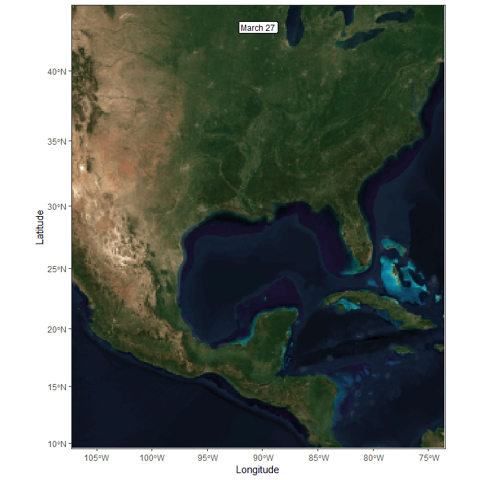

# motusVis

Visualise Motus Data using moveVis

## Introduction

These functions are wrappers to make it a little bit easier to make
animated maps of Motus tracks.

See [moveVis](https://movevis.org/) to learn more about the R library

## Dependencies

These functions were created using R version 4.5.1 and were not tested
on other versions.

These functions depend on the following libraries: - tidyverse - motus -
moveVis - sf - lubridate

# Function reference

## animate_frames

```         
animate_frames(
  data.input, 
  resolution.time = 1, 
  resolution.unit = 'days', 
  combine.years = F, 
  save.prefix, 
  colour.scale = "discrete", 
  colour.var = "tagDeployID",
  colour.vals = c("violetred", "turquoise"),
  show_scale = T,
  show.northarrow = T,
  text.colour = "black",
  bbox = NULL,
  map.service = "osm", 
  map.type = "topographic", 
  map.raster,
  map.api.key,
  map.api.key.file = "api_token"
)
```

### Arguments

|  |  |
|--------------------|----------------------------------------------------|
| data.input | Dataframe or SQLite database: Motus dataset |
| resolution.time | (Optional) Number: duration of a single frame |
| resolution.unit | (Optional) Character: unit of duration of a single frame. Can be: "days", "hours", "minutes" |
| combine.years | (Optional) Boolean: combine years into a single year? |
| save.prefix | (Optional) Character: Custom prefix for output files |
| colour.scale | (Optional) Character: Either "gradient" or "discrete" |
| colour.var | (Optional) Character: Variable used to colour tracks |
| colour.vals | (Optional) Character: Possible colour values |
| show.scalebar | (Optional) Boolean: Show scale bar? |
| show.northarrow | (Optional) Boolean: Show north arrow? |
| text.colour | (Optional) Character: Colour of scale bar and north arrow |
| bbox | (Optional) Named vector: Bounding box of tracks with xmin,xmax,ymin,ymax. Use st_bbox for simple use. |
| map.service | (Optional) Character: Map +service provider. See get_maptypes() for a list of available map services. |
| map.type | (Optional) Character: Map type. See get_maptypes() for a list of available map types. |
| map.api.key | (Optional) Character: API key for map service |
| map.api.key.file | (Optional) Character: Filename/location where API key is stored. See details. |
| map.raster | (Optional) terra object: Either a SpatRaster (mono-temporal) or SpatRasterDataset (multi-temporal). See frames_spatial() for details. |

### Details


# Example

```
library(tidyverse)
source('animate-track.fn.r')
source('get_bbox_with_aspect_ratio.fn.r')

# Directory where input data is stored
dir <- "D:/Data/"
# Filename of input data
file.name <- "GWWA_Movement_data.csv"

# Load in the data
gwwa.df <- read.csv(paste0(dir, file.name)) %>%
  filter(Include == 1, Detection_type != "Capture")
  
### Select a bounding box of a requested aspect ratio
bbox <- get_bbox_with_aspect_ratio.fn(gwwa.df, 1, margin = 1, coords = c("recvDeployLon","recvDeployLat"), crs=4326)

animateTrack( 
  gwwa.df, 
  combine.years = T, 
  resolution.time = 0.25, 
  resolution.unit = 'days', 
  save.prefix = "GWWA", 
  colour.scale = "gradient", 
  colour.var = "departureDate", 
  map_service = "maptiler", 
  map_type = "satellite", 
  bbox = bbox, 
  show_scale = F, 
  show_northarrow = F )
```


